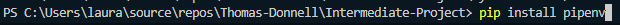
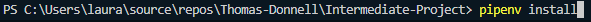
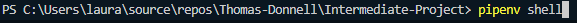
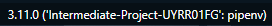
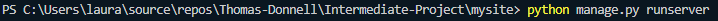

Intermediate Project
=============
## [Demo Site](https://clarkdonnell.pythonanywhere.com/)
# 🚀 Getting Started
### This project uses pipenv as its package manager    After cloning the directory follow these steps...
1. **install the pipenv package manager**
    * 
2. **Install the dependencies, Make sure you are in the project directory**
    * 
3. **Run the virtual environment shell**
    * 
4. **Check to make sure you are running the correct interpreter**
    * 
5. **Change your directory to the main app directory ("mysite")**
    * 
6. **Run the server!**
    * 

### Congratulations You Did It :tada:
